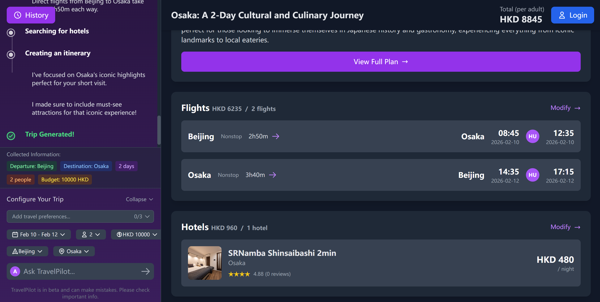
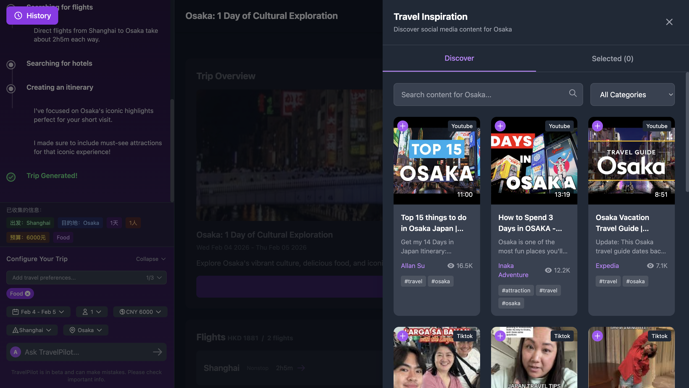
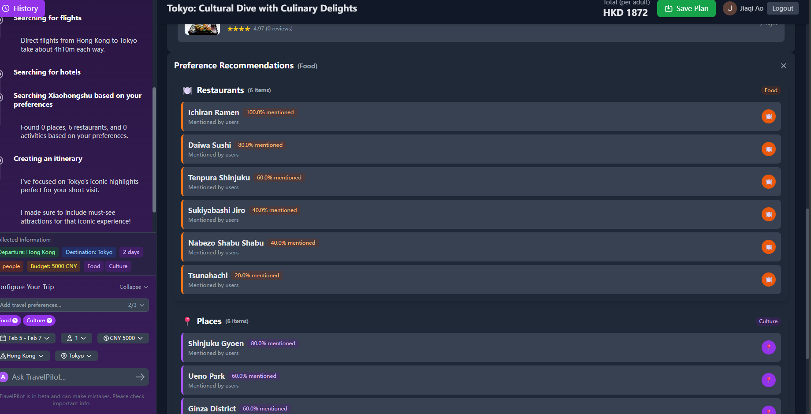
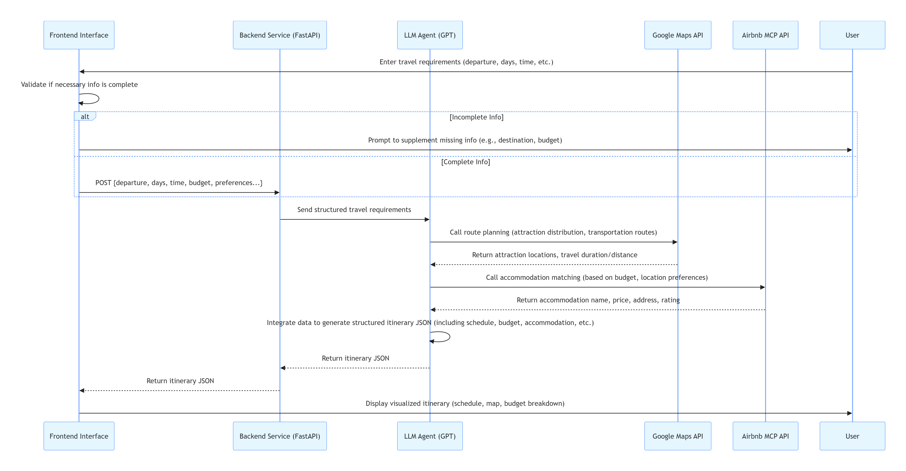

## TravelPilot: A LLM-Based Agent for customized Travelling  

一个使用 React 前端和 FastAPI 后端的 AI 旅行规划器，支持通过 MCP 服务器访问实时数据。

### 功能特性

- 🏨 **实时 Airbnb 数据**：使用 Airbnb MCP 服务器获取真实的住宿信息和价格
- 🗺️ **Google Maps 集成**：精确计算距离和旅行时间
- 🔍 **实时网络搜索**：获取最新的旅行信息、评论和更新
- 📅 **日历导出**：将行程导出为 ICS 文件，可导入 Google Calendar、Apple Calendar 或 Outlook
- ⚡ **现代化前端**：使用 React 构建的响应式用户界面

**Trip Overview**


**Trip Detail**


**Flight Ticket**



**Social Media**



**Preference**



### 系统架构

**MCP工具**: GPT 4o, Google Maps API, Airbnb MCP

**输入**:Departure, destination,start/end date of the trip, travel duration, number of travelers, total budget, travel preference

**输出**: 

A JSON follows the structure with "trip_overview", "accommodation", "daily_itinerary", and "budget_breakdown".

**执行过程**:

1. 接收用户输入，并检查是否已完整填写了必填信息（出发地点、出行日期、行程时长）；若信息不完整，则提示用户补充完整。

2. 使用包含完整信息的 GPT 模型进行调用，该模型会调用谷歌地图 API（用于路线规划）和爱彼迎 MCP API（用于住宿匹配），以生成按照指定格式生成的结构化 JSON 旅行计划。



### 系统要求

1. **API Keys** (两者都需要):
    - **OpenAI API Key**: 从 [OpenAI Platform](https://platform.openai.com/api-keys) 获取 
    - **Google Maps API Key**: 从 [Google Cloud Console](https://console.cloud.google.com/apis/credentials) 获取 （新增：需要在API限制中加入YouTube Data API v3 和 Custom Search API）
    - **Google Search Engine ID**: 从 [Google Console](https://cse.google.com/controlpanel/all)获取 （新增）

2. **Python 3.10+**: 确保已安装 Python 3.10 或更高版本

3. **Node.js 16+**: 用于运行 React 前端（建议使用 npm 或 yarn）

4. **MCP Servers**: 应用会自动连接到:
    - **Airbnb MCP Server**: 提供真实的 Airbnb 房源和价格数据
    - **Custom Google Maps MCP**: 实现精确的距离计算和位置服务

### 快速开始

#### 1. 安装 Python 依赖

```bash
pip install -r requirements.txt
```

#### 2. 安装 Node.js 依赖

```bash
cd frontend
npm install
cd ..
```

#### 3. 启动应用

**终端 1 - 启动后端服务器：**
```bash
python main.py
```
后端将在 http://localhost:8000 运行

**终端 2 - 启动前端开发服务器：**
```bash
cd frontend
npm run dev
```
前端将在 http://localhost:3000 运行

**终端 3 - 启动前端开发服务器：**

```bash
npm install -g rednote-mind-mcp
# 首次使用，运行登录向导
rednote-init
# 或
rednote-mind-mcp init

# 运行代码
python xhs.py
```

[rednote-mind-mcp配置指南](https://www.npmjs.com/package/rednote-mind-mcp)

#### 4. 使用应用

1. 在浏览器中访问 http://localhost:3000
2. 在左侧边栏输入您的 **OpenAI API key** 和 **Google Maps API key**
3. 填写旅行信息（目的地、天数、预算、偏好等）
4. 点击"🎯 生成行程"按钮创建详细的旅行计划
5. （可选）点击"📅 下载为日历"导出 ICS 文件

### 项目成员
Yu Bohan                                   
Ao Jiaqi 
Su Yongchao                           
Chen Zhenyan 
Yu Haoguang 

